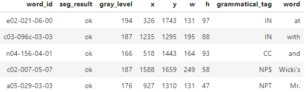

# Handwritten Words Recognition


With help from  [Aakash Nain and Sayak Paul's keras example](https://keras.io/examples/vision/handwriting_recognition/), I have built a prototype streamlit app that can recognize handwritten words. 

Here are some examples of the results of the model.


This project revolves around a state-of-the-art CRNN model with CTC loss, designed to excel in complex sequence-to-sequence tasks like handwritten word recognition and speech recognition. To showcase its potential, I've built a prototype Streamlit app. This marks the beginning of an ongoing project, with continuous improvements and enhancements on the horizon.

The importance of Optical Character Recognition (OCR) cannot be overstated. It digitizes text, revolutionizing data entry and enhancing accessibility. OCR is at the forefront of AI and machine learning, transforming how we interact with textual information.


### Software Requirements:
    - Pandas
    - Numpy 
    - Matplotlib  
    - Streamlit
    - TensorFlow 
    
### Application:

To run the application:

   - Install all required libraries listed above under 'Software Requirements'
   - Download data/words.tgz [from here](https://fki.tic.heia-fr.ch/databases/download-the-iam-handwriting-database)
       - unpack tgz file and place in data/ directory in the following structure:
       - chicken-scratch-recognition(home repo)
           - data
               - IAM_Words
                   - words.txt
                   - words
                       - a01 - r06
   - Navigate to **/streamlit_app** directory and run the following console command
```console
streamlit run streamlit_app.py
```

To use application. Input png files of cropped, handwritten words

Here is what the app should look like:


### File structure:

- Code folder
    - [word_recognition.ipynb](code/word_recognition.ipynb)
        - A thorough walkthrough of the entire process.
        - Includes:
            - Exploration of Data with relevant visualizations
            - Thorough preprocessing techniques 
            - Explanation of CTC and model training
        - Requirements (listed under 'Software Requirements' above)
    - [word_recognizer_model_only.ipynb](code/word_recognizer_model_only.ipynb)
        - Solely used for time intensive model training. 
    - [true_inference.ipynb](code/true_inference.ipynb)
        - Used to create modular functions for eventual use in streamlit app    
- Data folder 
    - IAM_Words
        -  words.txt - pseudo data dictionary - explanation below under 'Data Description'
        -  words (not in repo. must be downloaded)
            - a01 - r06 (not in repo. must be downloaded)
    - Further explanation down below under 'Data Description'
        
- Media folder
    - Images used/created throughout the project

- Models_Pickles folder
    - **prediction_model_2.keras** - Final model that is used in the Streamlit App
    - Various other models and pickles used/generated in project
 

- Streamlit folder
    - **streamlit_app_v1.py** - streamlit app


    
### Data Description:

Over 96,456 handwritten words from the IAM dataset. Commonly used in OCR applications

Data Acquisition: data/words.tgz - Contains words (example: a01/a01-122/a01-122-s01-02.png).[Downloaded From Here](https://fki.tic.heia-fr.ch/databases/download-the-iam-handwriting-database)

Data Ingestion and Cleaning: Thorough process is outlined in [word_recognition.ipynb](code/word_recognition.ipynb) 

data/IAM_Words/words.text - is a pseudo data dictionary. The following is a dataframe with th pertinent information extracted from words.txt



##### Columns:
    - word_id - a unique identifier for each png. corresponds to filename

    - seg_result - result of word segmentation. ok and err
    - gray_level - graylevel to binarize the line containing this word
    - x - -> bounding box around this word in x,y,w,h format
    - y - -> bounding box around this word in x,y,w,h format
    - w - -> bounding box around this word in x,y,w,h format
    - h - -> bounding box around this word in x,y,w,h format
    - grammatical_tag - the grammatical tag for this word
    - word -  the transcription for this word

### Model Performance

Here's a plot of the loss (measured by edit distance):


### Contributor:
    
**Kalyan Lakshmanan** 
    - [Github](https://github.com/kalymaan) 
    - [LinkedIn](https://www.linkedin.com/in/kalyanlakshmanan/) 
    
    
### Special Thanks:

**Aakash Nain** 
    - [Github](https://github.com/AakashKumarNain) 
    - [Website](https://aakashkumarnain.github.io/)    
**Sayak Paul** 
    - [Github](https://github.com/sayakpaul) 
    - [Website](https://sayak.dev/) 
    
- To my advisors: Musfiqur Rahman, Sonyah Seiden, and Eric Bayless
- To the rest of my General Assembly cohort

